## Objective
Understand SQL Injection and how to prevent it.

## Lab 6

For this lab, you will need to be able to edit form fields before submitting them.
This is a basic and common technique that attackers use to test websites for vulnerabilities.

We will use the [Chrome Browser](https://www.google.com/chrome/browser/desktop/index.html) for this lab. 
If you don't want to use Chrome, there are many alternatives. [Zap](https://www.owasp.org/index.php/OWASP_Zed_Attack_Proxy_Project) is an excellent choice. But setup and configuration of Zap (or other alternatives) are beyond the scope of this lab.

[WebGoat](https://owasp.org/www-project-webgoat/) is a deliberately insecure web application maintained by [OWASP](http://www.owasp.org/) designed to teach web application security lessons.

This program is a demonstration of common server-side application flaws. The exercises are intended to be used by people to learn about application security and penetration testing techniques.

<span style="color:red">**WARNING:exclamation:**</span> While running this program your machine will be extremely vulnerable to attack.

So <span style="color:red">**DO NOT**</span> run it using your machine, run it on [Docker Playground](http://play-with-docker.com) instead.

Go to the [Docker Playground](http://play-with-docker.com) and select `Login`

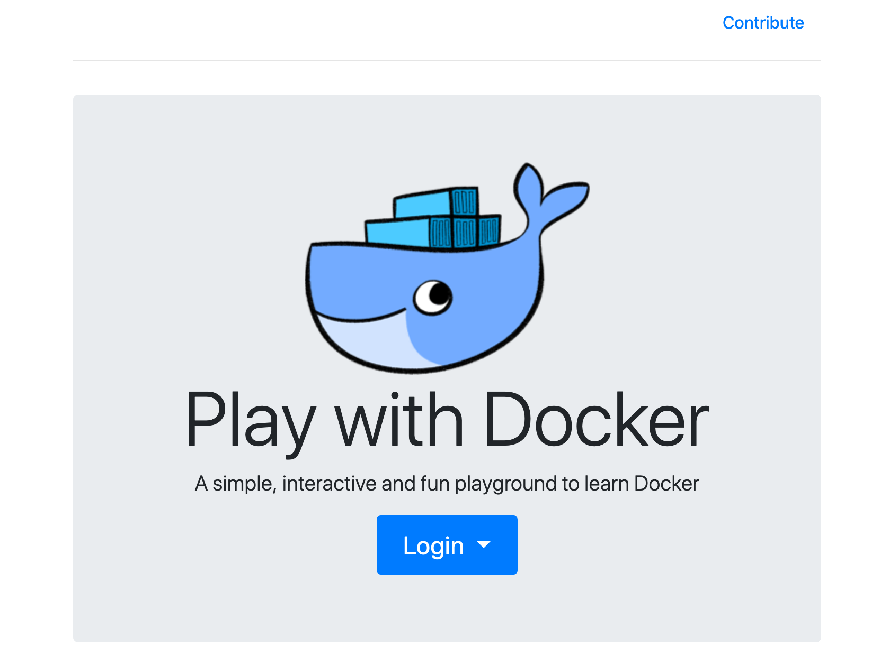

### Step1: Create a new instance

In the left-hand menu, click on `ADD NEW INSTANCE`. This will start a Docker instance (node) and log you in as the root user.

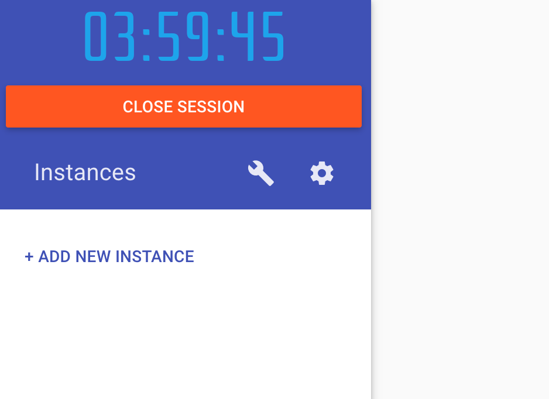 <br/>

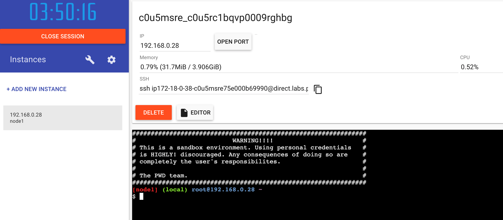

### Step2: Start WebGoat
Run this command 
```
docker run -p 8080:8080 -p 9090:9090 webgoat/goatandwolf
```

You should see a bunch of output that ends in something like this:
```
2021-03-01 03:25:34.129  INFO 27 --- [           main] o.s.b.a.e.web.EndpointLinksResolver      : Exposing 2 endpoint(s) beneath base path '/actuator'
2021-03-01 03:25:34.353  INFO 27 --- [           main] io.undertow                              : starting server: Undertow - 2.0.28.Final
2021-03-01 03:25:34.394  INFO 27 --- [           main] org.xnio                                 : XNIO version 3.3.8.Final
2021-03-01 03:25:34.444  INFO 27 --- [           main] org.xnio.nio                             : XNIO NIO Implementation Version 3.3.8.Final
2021-03-01 03:25:35.064  INFO 27 --- [           main] o.s.b.w.e.u.UndertowServletWebServer     : Undertow started on port(s) 8080 (http) with context path '/WebGoat'
2021-03-01 03:25:35.068  INFO 27 --- [           main] org.owasp.webgoat.StartWebGoat           : Started StartWebGoat in 42.104 seconds (JVM running for 43.618)
```
<b>Note:</b> There might be some 'warnings' at the end. No need to be worried if you see/don't see the warnings. 

You should also see the `IP` and `OPEN PORT` `8080` information on the top.

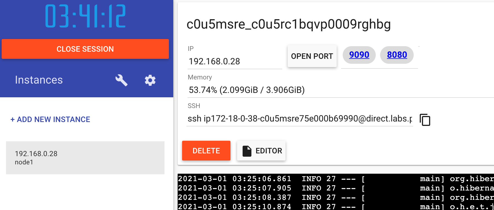

That 8080 is a link, click on it. This should take you to a URL that looks something like:

http://ip172-18-0-38-c0u5msre75e000b69990-8080.direct.labs.play-with-docker.com

**Your exact URL will be different.**

<b>Note:</b> If you didn't see `8080` next to `OPEN PORT` on the top. like below, then click `OPEN PORT` and enter `8080`

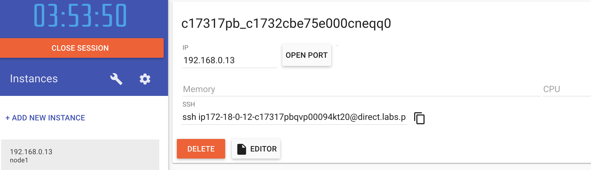

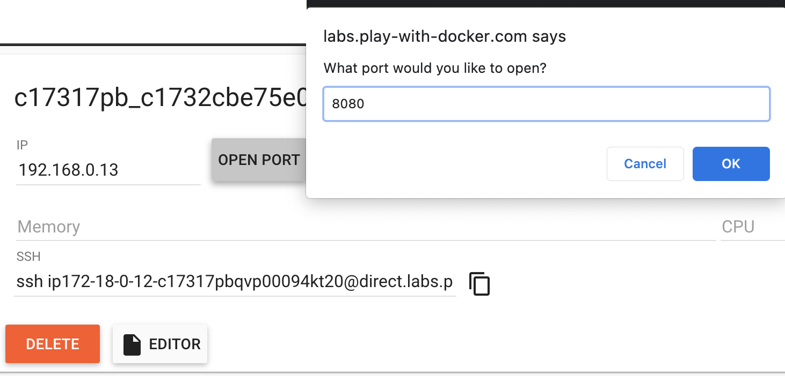


You **should get an error** on this page. In your browser's address bar, append **/WebGoat/** to the end of the URL and hit enter.

For example: http://ip172-18-0-12-c17317pbqvp00094kt20-8080.direct.labs.play-with-docker.com/WebGoat/

You should now see something like this:

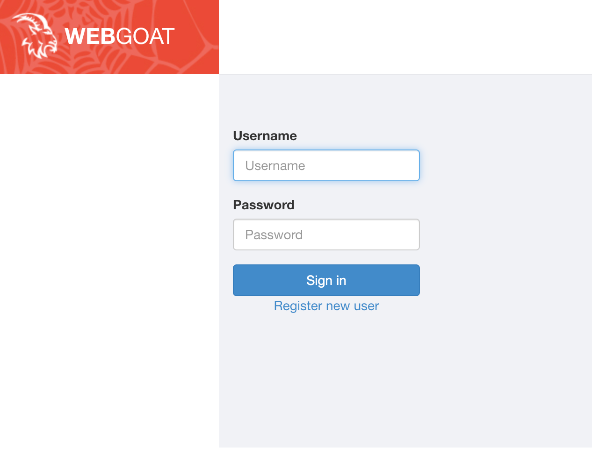

Register a new user and login

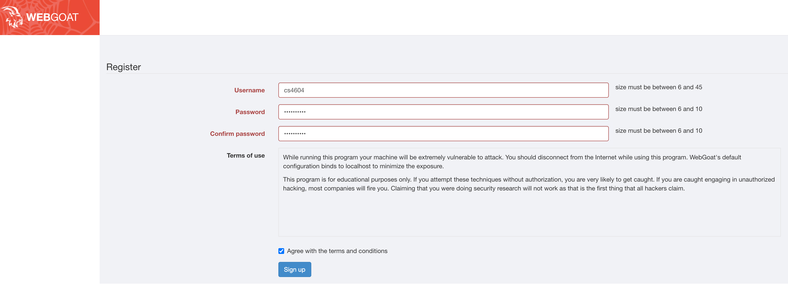

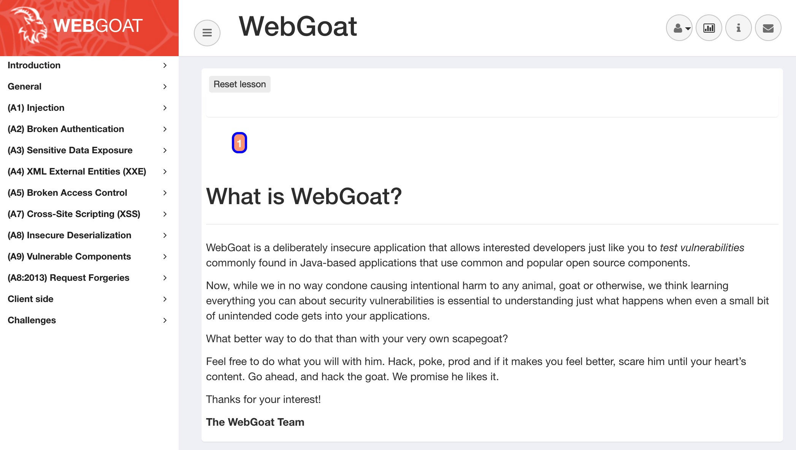

### Step3: SQL Injection Labs

* In the left-hand menu, click on **(A1) Injection -> SQL Injection (intro)**.

    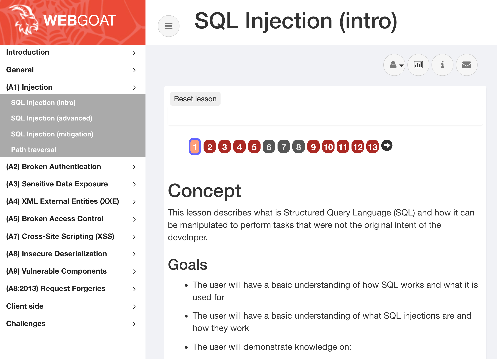

    You can start attempting these labs by completing each of the stages.

* If you finish all the stages successfully in a lab, it will look like this below

    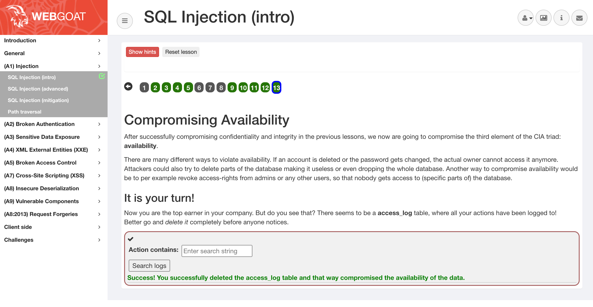

* You will get 100 if you finish some stages in `SQL Injection (intro)`

* If you want to get extra points, attempt these:
    * SQL Injection (advanced)
    * SQL Injection (mitigation)
    * Path traversal

    You will get 30 to 100 extra points. If you finish one, you get 30 extra points. If you finish two, you get 60 extra points. If you finish three, you get 100 extra points. **Important** these labs are challenging so be aware not to spend too much time on this. It is up to you! 

## Submission

1. Do your best and complete any number of stages in `SQL Injection (intro)`, take a screenshot `yourPID_Lab_6.png` and submit it to Canvas `Lab 6 assignment -> proof`
2. For extra points, package your solutions into a `yourPID_Lab_6.zip` file and upload it to Canvas `Lab 6 assignment -> extras` 
