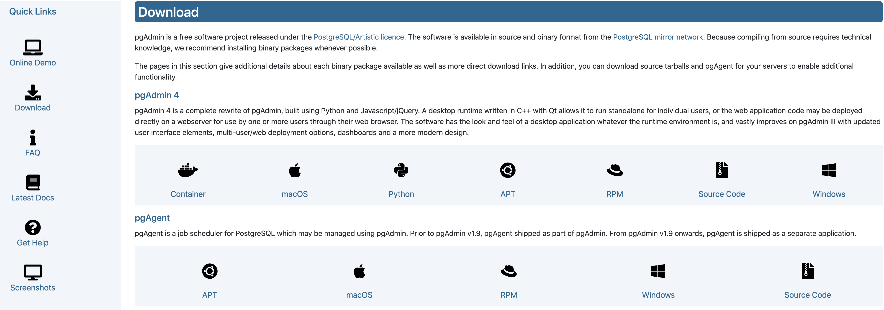
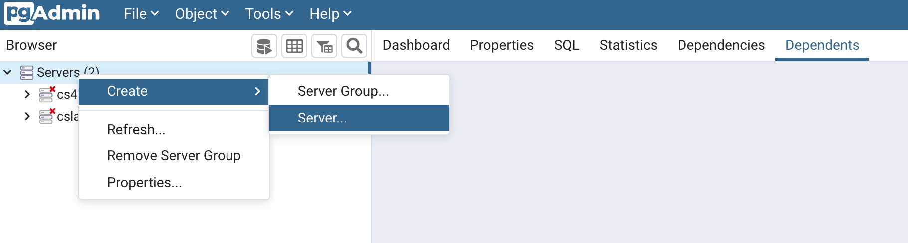
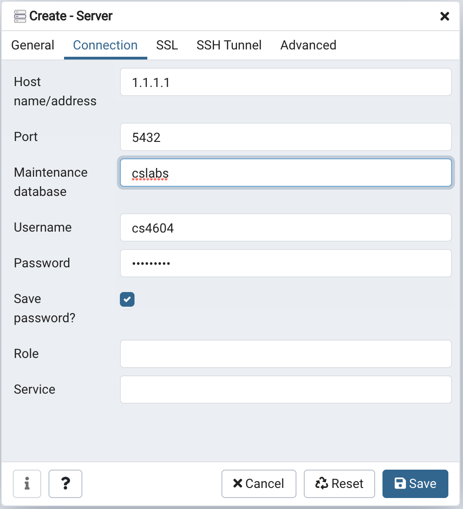
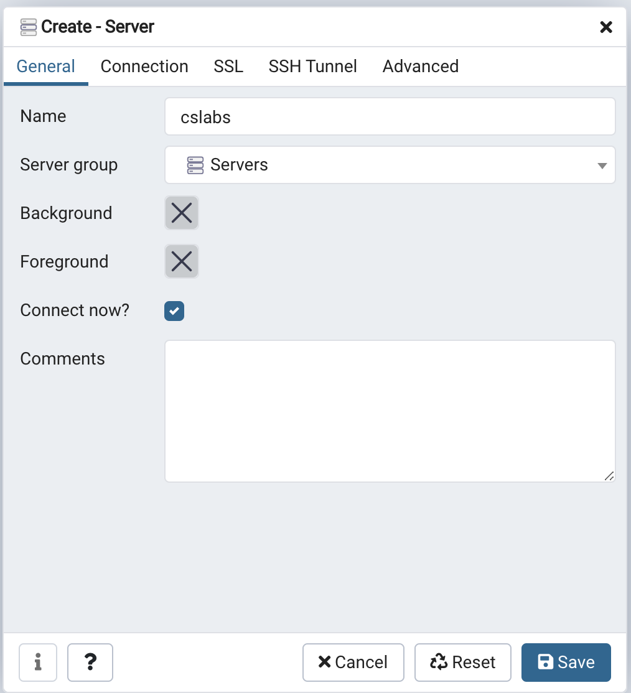
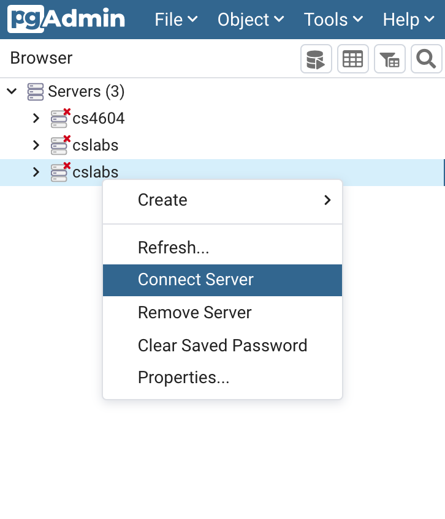
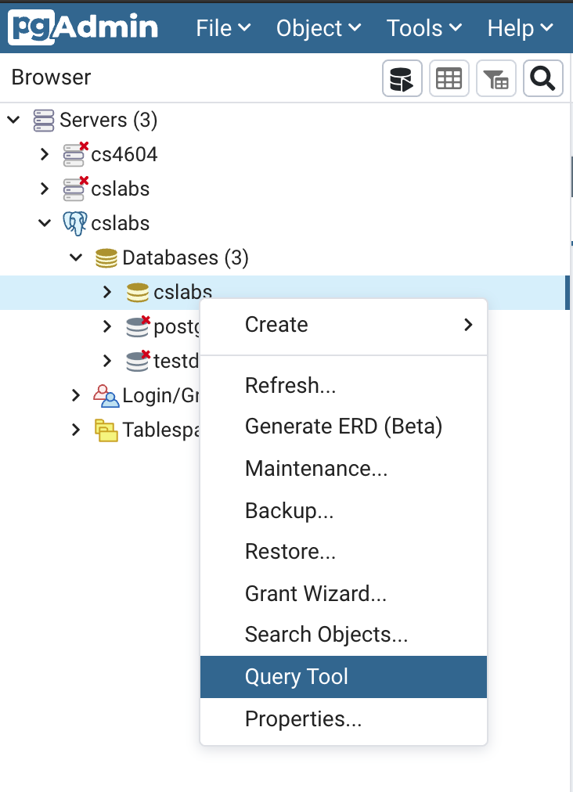
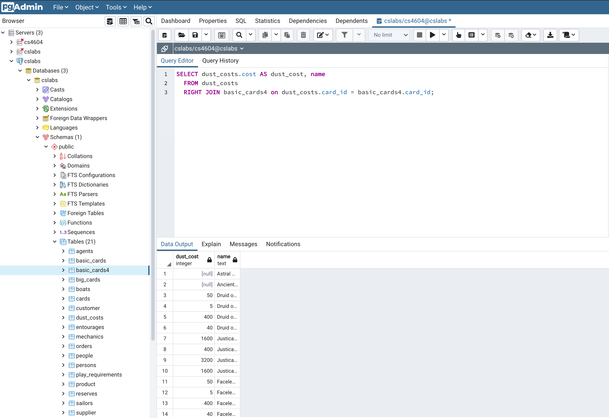
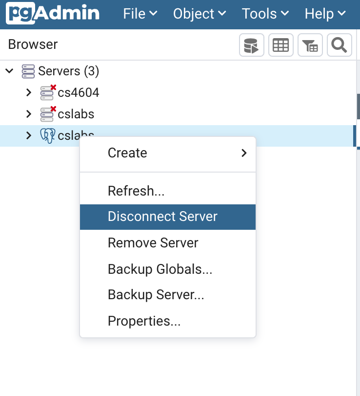

# How to connect a PostgreSQL database using pgAdmin

## Installation
See: https://www.pgadmin.org/download/

## Create a server connection

* Step 1: Create a server connection profile

* Step 2: Enter server information. Select `Connection` tab

You can find the `host` and `password` information of  `cslabs` database in the Canvas

* Step 3: Name this server connection profile 

Click `Save`

## Connect to Server database 

Select a server profile and click `Connect Server`

## Open Query Tool

Select `cslab` and choose `Query Tool`

## Run SQL query

In the `Query Editor`, type your SQL and click :arrow_forward:

## Disconnect Server database

